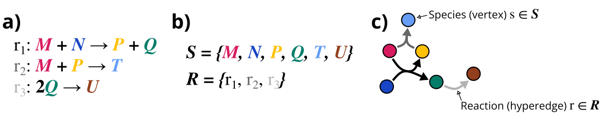

# SimpleDirectedHypergraphs.jl

[](https://CoReACTER.org/SimpleDirectedHypergraphs.jl/stable/)
[](https://CoReACTER.org/SimpleDirectedHypergraphs.jl/dev/)
[](https://github.com/CoReACTER/SimpleDirectedHypergraphs.jl/actions/workflows/CI.yml?query=branch%3Amain)
[](https://codecov.io/gh/CoReACTER/SimpleDirectedHypergraphs.jl)

`SimpleDirectedHypergraphs.jl` is a Julia package for directed hypergraph data structures. It builds off of [SimpleHypergraphs.jl](https://github.com/pszufe/SimpleHypergraphs.jl), which in turn implements the [Graphs.jl interface](https://juliagraphs.org/Graphs.jl/stable/core_functions/interface/).

## What is a directed hypergraph?

A *hypergraph* is a generalization of a graph. Specifically, a conventional graph is a hypergraph where all *hyperedges* connect exactly two *vertices*. In a general hypergraph, hyperedges can connect any number of vertices. They are therefore natural mathematical objects for the study of networks or systems involving interactions between more than two entities. More formally, a hypergraph $H$ is an ordered pair $(V; E)$, where $V$ is the set of vertices and $E$ is the set of hyperedges. Each hyperedge in turn is a subset of $V$, *i.e.*, $\forall e \in E, e \subseteq V$.

`SimpleHypergraphs.jl` represents hypergraphs via a (weighted) $m \times n$ *incidence matrix* $I$, where $m = |V|$, $n = |E|$, and $I_{i,j} =$ `nothing` if vertex $i$ is not in hyperedge $j$ and $I_{i,j} = q$ otherwise, where $q$ is some real value. Actually, hypergraphs in `SimpleHypergraphs.jl` are defined as matrices:

```
abstract type AbstractHypergraph{T} <: AbstractMatrix{T} end
```

A *directed hypergraph* is, analogously, a generalization of a directed graph. There are many possible definitions of hypergraphs in use in the literature. Here, we take a rather general definition: a directed hypergraph 

$$\overrightarrow{H} := (V; \overrightarrow{E})$$

where a *directed hyperedge*

$$\overrightarrow{e} := (e^t \subseteq V; e^h \subseteq V)$$

Here, $e^t$ is called the *tail* of the directed hyperedge, and $e^h$ is called the head. In our definition, the head and tail can both include any number of vertices (limited, of course, by the size of $V$).

Like the undirected hypergraphs in `SimpleHypergraphs.jl`, we represent directed hypergraphs in `SimpleDirectedHypergraphs.jl` as matrices. Under the hood, a directed hypergraph is made up of two undirected hypergraphs: one representing the "tails" and one representing the "head".

## What are directed hypergraphs good for?

At the risk of stating the obvious, a directed hypergraph is useful in cases where there are multiple components (vertices) connected by some interaction that (at least sometimes) involves more than two components, and where interactions have a sense of directionality or asymmetry.

The initial motivation for this package was to study chemical reaction networks (CRNs), which describe systems of (potentially interacting or mutually dependent) reactions:



Other applications of directed hypergraphs include [transportation systems, databases](https://doi.org/10.1016/0166-218X(93)90045-P), and [decision theory](https://doi.org/10.1109/ACCESS.2024.3415120).

## Installation

`SimpleDirectedHypergraphs.jl` can be installed from the Julia REPL (in `pkg` mode, entered by pressing the "]" key):

```
(ENVIRONMENT) pkg> add SimpleDirectedHypergraphs
```

Note that `SimpleHypergraphs.jl` has a Python dependency, but it is only necessary for plotting. If you want to use the available plotting functions for non-directed hypergraphs, you'll need to follow the additional installation instructions in the [SimpleHypergraphs.jl README](https://github.com/pszufe/SimpleHypergraphs.jl).

## Features and contributing

`SimpleDirectedHypergraphs.jl` is still in early development. Things could change significantly, and the interface could even break!

Currently, this package is rather lean. Currently implemented features include:
- An abstract type for directed hypergraphs (`AbstractDirectedHypergraph`)
- A concrete `DirectedHypergraph` type, which can be constructed directly, using `Graphs.jl` `SimpleDiGraph`, or using matrices.
- Extensions of some `SimpleHypergraphs.jl` functionality, including functions to modify directed hypergraphs (*e.g.*, by pruning or adding hyperedges), bipartite and two-section views, and random hypergraph models
- Simple input/output operations, *e.g.*, to JSON
- Algorithms to detect weakly and strongly connected components, with the latter based on the work of Francisco José Martín-Recuerda Moyano (PhD dissertation, 2016).

If you have suggestions of features that you want added, please make suggestions in the [GitHub Issues](https://github.com/CoReACTER/SimpleDirectedHypergraphs.jl/issues) page. You are also encouraged to add new features yourself; pull requests are always welcome.