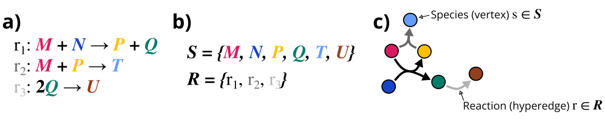

# SimpleDirectedHypergraphs.jl

![The SimpleDirectedHypergraphs.jl logo: above the package name (written in black font) is a directed hypergraph, with vertices represented by filled circles (one blue, one red, one green, one purple, and four gray) and directed hyperedges represented by curved multi-tailed/multi-headed arrows (one black, connecting the red and blue vertices on the tail end with the purple and green vertices on the head end; and three gray with dashes lines). The blue vertex replaces the 'i' in "Simple", and the purple vertex replaces the 'i' in "Directed".](./assets/sdhg_logo_whitebackground.png)

[](https://coreacter.codeberg.page/SimpleDirectedHypergraphs.jl)
[](https://ci.codeberg.org/repos/15645)
[](https://github.com/fredrikekre/Runic.jl)

`SimpleDirectedHypergraphs.jl` is a Julia package for directed hypergraph data structures, intended for use constructing and analyzing complex networks. It builds off of [SimpleHypergraphs.jl](https://github.com/pszufe/SimpleHypergraphs.jl), which in turn implements the [Graphs.jl interface](https://juliagraphs.org/Graphs.jl/stable/core_functions/interface/).

## What is a directed hypergraph?

A *hypergraph* is a generalization of a graph. Specifically, a conventional graph is a special case of a hypergraph where all *hyperedges* connect exactly two *vertices*. In a more general hypergraph, hyperedges can connect any number of vertices. They are therefore natural mathematical objects for the study of networks or systems involving interactions between more than two entities. More formally, a hypergraph $H$ is an ordered pair $(V; E)$, where $V$ is the set of vertices and $E$ is the multiset of hyperedges. Each hyperedge in turn is a subset of $V$, *i.e.*, $\forall e \in E, e \subseteq V$.

`SimpleHypergraphs.jl` represents hypergraphs via a (weighted) $m \times n$ *incidence matrix* $I$, where $m = |V|$, $n = |E|$, and $I_{i,j} =$ `nothing` if vertex $i$ is not in hyperedge $j$ and $I_{i,j} = q$ otherwise, where $q$ is some real value. Actually, hypergraphs in `SimpleHypergraphs.jl` are defined as matrices:

```
abstract type AbstractHypergraph{T} <: AbstractMatrix{T} end
```

A *directed hypergraph* (*dihypergraph*) is, analogously, a generalization of a directed graph. There are multiple possible definitions of dihypergraphs in use in the literature. Here, we take a rather general definition: a dihypergraph 

$$\overrightarrow{H} := (V; \overrightarrow{E})$$

where a *directed hyperedge* (dihyperedge)

$$\overrightarrow{e} := (e^t \subseteq V; e^h \subseteq V)$$

Here, $e^t$ is called the *tail* of the dihyperedge, and $e^h$ is called the *head*. In our definition, the head and tail can both include any number of vertices (limited, of course, by the size of $V$). As with the hypergraph definition given above, $\overrightarrow{E}$ is a multiset, so dihyperedges can be repeated.

Like the undirected hypergraphs in `SimpleHypergraphs.jl`, we represent dihypergraphs in `SimpleDirectedHypergraphs.jl` as matrices. Under the hood, a dihypergraph is made up of two undirected hypergraphs: one representing the "tails" and one representing the "heads".

## What are dihypergraphs good for?

At the risk of stating the obvious, a dihypergraph is useful in cases where there are multiple components (vertices) connected by some interaction that (at least sometimes) involves more than two components, and where interactions have a sense of directionality or asymmetry.

The initial motivation for this package was to study chemical reaction networks (CRNs), which describe systems of (potentially interacting or mutually dependent) reactions:



Other applications of dihypergraphs include [transportation systems, databases](https://doi.org/10.1016/0166-218X(93)90045-P), and [decision theory](https://doi.org/10.1109/ACCESS.2024.3415120).

## Installation

`SimpleDirectedHypergraphs.jl` can be installed from the Julia REPL (in `pkg` mode, entered by pressing the "]" key):

```
(ENVIRONMENT) pkg> add SimpleDirectedHypergraphs
```

Note that `SimpleHypergraphs.jl` has a Python dependency, but it is only necessary for plotting. If you want to use the available plotting functions for undirected hypergraphs, you'll need to follow the additional installation instructions in the [SimpleHypergraphs.jl README](https://github.com/pszufe/SimpleHypergraphs.jl).

## Features and contributing

`SimpleDirectedHypergraphs.jl` is still in early development. Things could change significantly, and the interface could even break!

Currently implemented features include:
- An abstract type for dihypergraphs (`AbstractDirectedHypergraph`)
- A concrete `DirectedHypergraph` type, which can be constructed directly, using `Graphs.jl` `SimpleDiGraph`, or using matrices.
- Extensions of some `SimpleHypergraphs.jl` functionality, including functions to modify dihypergraphs (*e.g.*, by pruning or adding hyperedges), bipartite and two-section views, and random hypergraph models
- Simple input/output operations, *e.g.*, to the JSON-based Hypergraph Interchange Format ([HIF](https://doi.org/10.1017/nws.2025.10018))
- Algorithms to detect weakly and strongly connected components, with the latter based on the work of Francisco José Martín-Recuerda Moyano (PhD dissertation, 2016)
- Shortest-path, distance, and diameter algorithms, based on the work of Krieger & Kececioglu (DOI: [10.1186/s13015-022-00217-9](https://doi.org/10.1186/s13015-022-00217-9) and DOI: [10.1089/cmb.2023.0242](http://doi.org/10.1089/cmb.2023.0242))
- The quad clustering algorithm (DOI: [10.1063/5.0188246](https://doi.org/10.1063/5.0188246)) for calculating the degree of clustering

If you have suggestions of features that you want added, please make suggestions in the [Codeberg Issues](https://codeberg.org/CoReACTER/SimpleDirectedHypergraphs.jl/issues) page. You are also encouraged to add new features yourself. Pull requests are always welcome; see our guide to [contributing](./CONTRIBUTING.md) for more information.
